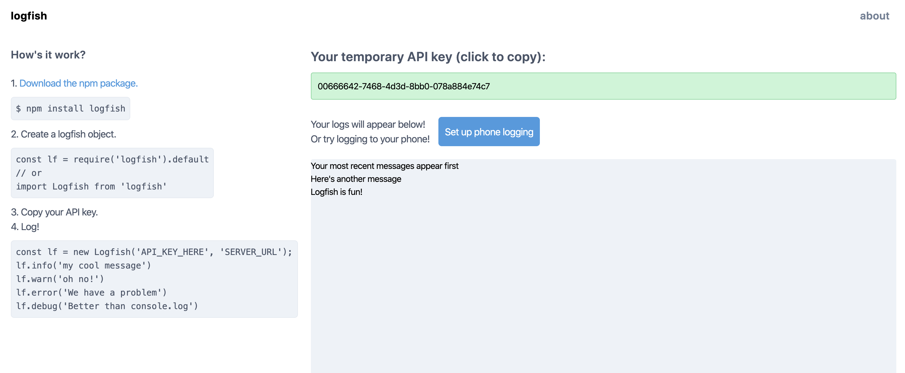

# logfish

Logfish is a simple solution for real time logging in the browser. It directs logged output to your browser so that it is not mixed in with other console output.

## Installation

npm:

```
$ npm install logfish
```

yarn:

```
$ yarn add logfish
```

## Usage

First, you will need to locally set up a Logfish client and server. You will need to clone each of the following repositories and follow the instructions in the README files.

Server: [https://github.com/bandrewfisher/logfish_server](https://github.com/bandrewfisher/logfish_server)

Client: [https://github.com/bandrewfisher/logfish_client](https://github.com/bandrewfisher/logfish_client)

```js
const Logfish = require("logfish").default;
// or
import Logfish from "logfish";

const lf = new Logfish("API_KEY_HERE", "http://localhost:8081");
lf.info("some handy info");
lf.warn("something could go wrong here!");
lf.debug("some variable value");
lf.error("something went wrong");
```

You will see the output from each of these calls in your Logfish client's console.



## API

Construct a new Logfish object:

### new Logfish(apiKey: string, url: string): Logfish

**apiKey**: The API key seen in your Logfish client's console. Note that when running the server locally in development mode, the default key will always be DEV_KEY. Otherwise, it will be a UUID string. See the instructions at [https://github.com/bandrewfisher/logfish_server#run-the-server-locally](https://github.com/bandrewfisher/logfish_server#run-the-server-locally) if you wish to run the server in production mode.

**url**: The URL of the server. The server defaults to running on port 8081, so unless you change the port in your code, this should usually just be "http://localhost:8081".

The following methods exist on a new `Logfish` object.

### lf.log(logData: any, { level }: LogConfig = { level: 'INFO' }): Promise\<void\>

Logs `logData` to the logfish.dev console. `logData` must be a string or a JSON serializable object.
`level` is one of 'INFO', 'WARN', 'DEBUG', or 'ERROR'.

### lf.info(logData: any): Promise\<void\>

Equivalent to `lf.log(logData, { level: 'INFO' })`

### lf.warn(logData: any): Promise\<void\>

Equivalent to `lf.log(logData, { level: 'WARN' })`

### lf.debug(logData: any): Promise\<void\>

Equivalent to `lf.log(logData, { level: 'DEBUG' })`

### lf.error(logData: any): Promise\<void\>

Equivalent to `lf.log(logData, { level: 'ERROR' })`
